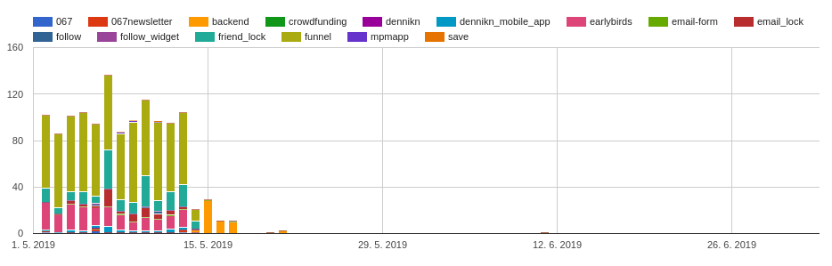
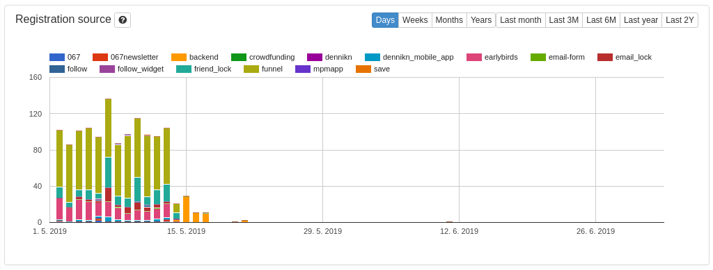
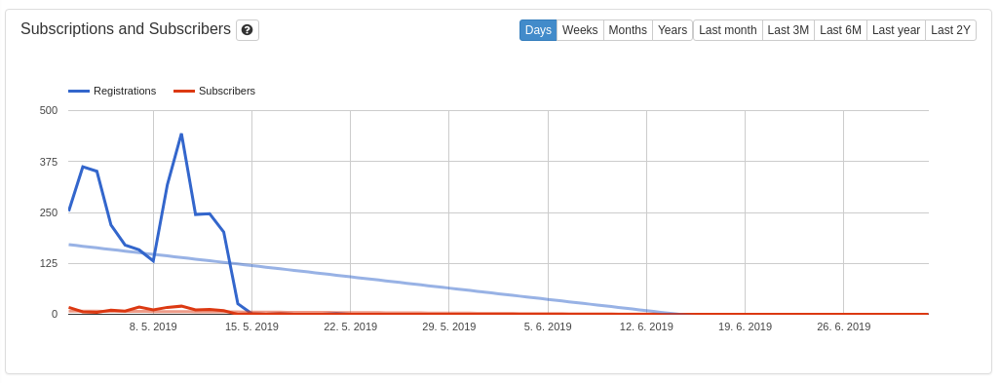
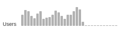

# CRM Application Module

## Components

**FrontendMenu**

Top frontend menu.

[Source code](https://github.com/remp2020/crm-application-module/blob/d35256140dba71e7839955da7a5205b3241f1923/src/components/FrontendMenu/FrontendMenu.php)

[How to use](https://github.com/remp2020/crm-application-module/blob/d35256140dba71e7839955da7a5205b3241f1923/src/presenters/FrontendPresenter.php#L115)

**Graphs**

General graph components.

- GoogleBarGraph

[Source code](https://github.com/remp2020/crm-application-module/blob/d35256140dba71e7839955da7a5205b3241f1923/src/components/Graphs/GoogleBarGraph/GoogleBarGraph.php)

[How to use](https://github.com/remp2020/crm-subscriptions-module/blob/b02c1e850d197ce82a58196d8b525ecb3bba5e7c/src/components/ActualSubscribersRegistrationSourceStatsWidget/ActualSubscribersRegistrationSourceStatsWidget.php#L53)

- GoogleBarGraphGroup

[Source code](https://github.com/remp2020/crm-application-module/blob/d35256140dba71e7839955da7a5205b3241f1923/src/components/Graphs/GoogleBarGraphGroup/GoogleBarGraphGroup.php)

[How to use](https://github.com/remp2020/crm-subscriptions-module/blob/b02c1e850d197ce82a58196d8b525ecb3bba5e7c/src/presenters/DashboardPresenter.php#L151)

- GoogleLineGraph

[Source code](https://github.com/remp2020/crm-application-module/blob/d35256140dba71e7839955da7a5205b3241f1923/src/components/Graphs/GoogleLineGraph/GoogleLineGraph.php)

[How to use](https://github.com/remp2020/crm-application-module/blob/d35256140dba71e7839955da7a5205b3241f1923/src/components/Graphs/GoogleLineGraphGroup/GoogleLineGraphGroup.php#L121)

- GoogleLineGraphGroup

[Source code](https://github.com/remp2020/crm-application-module/blob/d35256140dba71e7839955da7a5205b3241f1923/src/components/Graphs/GoogleLineGraphGroup/GoogleLineGraphGroup.php)

[How to use](https://github.com/remp2020/crm-subscriptions-module/blob/b02c1e850d197ce82a58196d8b525ecb3bba5e7c/src/presenters/DashboardPresenter.php#L68)

- InlineBarGraph

[Source code](https://github.com/remp2020/crm-application-module/blob/d35256140dba71e7839955da7a5205b3241f1923/src/components/Graphs/InlineBarGraph/InlineBarGraph.php)

[How to use](https://github.com/remp2020/crm-payments-module/blob/833351ff1ef4ec961c1f70dfca9f8541b4badbb9/src/presenters/PaymentGatewaysAdminPresenter.php#L81)

- SmallBarchart

[Source code](https://github.com/remp2020/crm-application-module/blob/d35256140dba71e7839955da7a5205b3241f1923/src/components/Graphs/SmallBarchart/SmallBarGraph.php)

[How to use](https://github.com/remp2020/crm-subscriptions-module/blob/b02c1e850d197ce82a58196d8b525ecb3bba5e7c/src/components/MonthSubscriptionsSmallBarGraphWidget/MonthSubscriptionsSmallBarGraphWidget.php#L59)

**VisualPaginator**

General pagination component.

[Source code](https://github.com/remp2020/crm-application-module/blob/d35256140dba71e7839955da7a5205b3241f1923/src/components/VisualPaginator/VisualPagiantor.php#L1)

[How to use](https://github.com/remp2020/crm-payments-module/blob/833351ff1ef4ec961c1f70dfca9f8541b4badbb9/src/presenters/PaymentsAdminPresenter.php#L73)

**Widgets**

General basic widget components.

- ListingActionWidget - listing actions wrapper

[Source code](https://github.com/remp2020/crm-application-module/blob/d35256140dba71e7839955da7a5205b3241f1923/src/components/Widgets/ListingActionWidget/ListingActionWidget.php#L1)

[How to use](https://github.com/remp2020/crm-application-module/blob/d35256140dba71e7839955da7a5205b3241f1923/src/presenters/BasePresenter.php#L93)

- SimpleWidget

[Source code](https://github.com/remp2020/crm-application-module/blob/d35256140dba71e7839955da7a5205b3241f1923/src/components/Widgets/SimpleWidget/SimpleWidget.php#L1)

[How to use](https://github.com/remp2020/crm-application-module/blob/d35256140dba71e7839955da7a5205b3241f1923/src/presenters/BasePresenter.php#L99)

- SimpleStatWidget - dashboard stats widget

[Source code](https://github.com/remp2020/crm-application-module/blob/d35256140dba71e7839955da7a5205b3241f1923/src/components/Widgets/SingleStatWidget/SingleStatWidget.php#L1)

[How to use](https://github.com/remp2020/crm-application-module/blob/d35256140dba71e7839955da7a5205b3241f1923/src/presenters/BasePresenter.php#L105)
