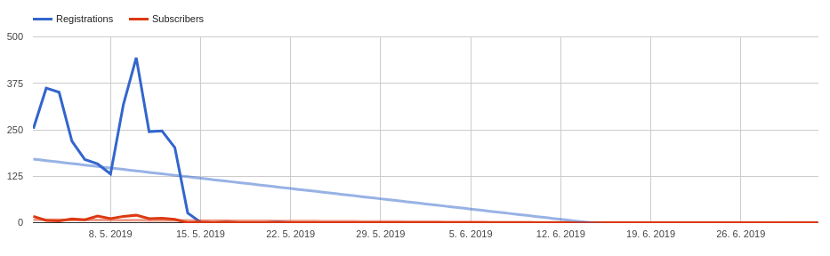
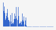
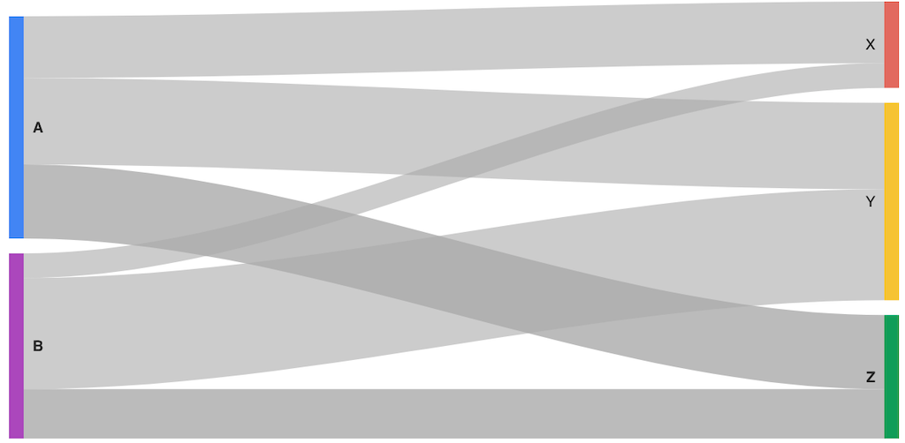
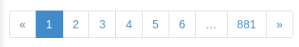
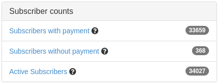

# CRM Application Module

## Configuration

You can configure default Redis keys prefix, which is used if implementation using RedisClientTrait enables prefixing via `useRedisKeysPrefix()` method.

```
crm_application:
    redis_client_factory:
        prefix: foo_
```

You can turn on prefixing for specific service using `RedisClientTrait` by calling `useRedisKeysPrefix()` method in configuration.

```
configsCache:
		setup:
			- useRedisKeysPrefix()
```


## Commands

### `application:heartbeat`

If your Hermes worker (`application:hermes_worker`) is losing connection to MySQL after a long period of inactivity, add `application:heartbeat` into your scheduler _(e.g. crontab)_ with small interval _(e.g. 1 minute)_.

> **WARNING: Change paths to PHP and command.php according to your installation.**

```shell
# emit heartbeat event
*/1 * * * * /usr/bin/php /var/www/html/bin/command.php application:heartbeat
```

Event is handled by `HeartbeatMysql` handler which pings MySQL. This simple process keeps Hermes worker alive.


### `application:hermes_shutdown`

Command `application:hermes_shutdown` can be used to gracefully shutdown Hermes worker and all other workers which integrate Hermes' `RestartInterface` _(eg. Scenarios worker present in [ScenariosModule](https://github.com/remp2020/crm-scenarios-module))_. This can be used after CRM update when it's needed to reload all workers to new version.

> **WARNING: Change paths to PHP and command.php according to your installation.**

```shell
/usr/bin/php /var/www/html/bin/command.php application:hermes_shutdown
```

User confirmation is required to proceed with shutdown of all worker.

In case you need to run this command without user interaction _(eg. CI, tests)_, use `--assume-yes` flag:

```shell
/usr/bin/php /var/www/html/bin/command.php application:hermes_shutdown --assume-yes
```

### `application:cleanup`

Command can be used to clean up data from repositories, which you don't need to keep forever (i.e. logs).

By default, the command deletes data older than 2 months (based on the `created_at` column). You can change the default threshold time before which the command deletes old repository data, and also column which it uses by using (in your project configuration file):

```neon
autoLoginTokensRepository:
	setup:
		- setRetentionThreshold('now', 'valid_at')
changePasswordsLogsRepository:
	setup:
		- setRetentionThreshold('-12 months')
userActionsLogRepository:
	setup:
		- setRetentionThreshold('-12 months')
```

## Components

#### [FrontendMenu](https://github.com/remp2020/crm-application-module/blob/d35256140dba71e7839955da7a5205b3241f1923/src/components/FrontendMenu/FrontendMenu.php)

User-facing frontend menu expected to be used in your application layout.

<details>
<summary>Example use</summary>

Use within your layout by using:

```neon
{control fronendMenu}
```

You can override the default layout of menu in your `config.local.neon`:

```neon
# ...
services:
    frontendMenu:
        setup:
            - setTemplate('../../../../../app/modules/DemoModule/templates/frontend_menu.latte')
# ...
```
</details>

<details>
<summary>Preview</summary>


</details>

##### FrontendMenuDataProviderInterface

Interface which dataproviders have to implement to be able to edit `FrontendMenu` items. Dataproviders have to be attached to `frontend_menu` dataproviders placeholder.

<details>
<summary>Example use</summary>

In this example `DemoFrontendMenuDataProvider` removes menu item from frontend menu by link.

```php
use Crm\ApplicationModule\DataProvider\DataProviderManager;

class DemoModule
{
    public function registerDataProviders(DataProviderManager $dataProviderManager)
    {
        $dataProviderManager->registerDataProvider(
            'frontend_menu',
            $this->getInstance(DemoFrontendMenuDataProvider::class)
        );
    }
}
```

```php
use Crm\ApplicationModule\DataProvider\DataProviderException;
use Crm\ApplicationModule\DataProvider\FrontendMenuDataProviderInterface;
use Crm\ApplicationModule\Menu\MenuContainerInterface;

class DemoFrontendMenuDataProvider implements FrontendMenuDataProviderInterface
{

    public function provide(array $params): void
    {
        if (!isset($params['menuContainer'])) {
            throw new DataProviderException('missing [menuContainer] within data provider params');
        }

        /** @var MenuContainerInterface $menuContainer */
        $menuContainer = $params['menuContainer'];
        $menuContainer->removeMenuItemByLink(':Invoices:Invoices:invoiceDetails');
    }
}
```
</details>

#### Graphs

Following is a set of various charts provided by the `ApplicationModule` out of the box.

##### [GoogleBarGraph](src/components/Graphs/GoogleBarGraph/GoogleBarGraph.php)

Simple bar graph based on Google charts. Usually used within GoogleBarGraphGroup component, but can be also used separately if you need to manage your groups (keys within `$data` parameter) manually.

<details>
<summary>Example use</summary>

To use the chart, create similar method in your presenter or widget:

```php
namespace Crm\DemoModule\Presenters;

class DemoPresenter extends \Crm\AdminModule\Presenters\AdminPresenter
{
    // ...
    public function renderDefault()
    {
    }

    public function createComponentGoogleUserSubscribersRegistrationSourceStatsGraph()
    {
        $control = $this->factory->create();

        $results = $this->database->table('subscriptions')
            ->where('subscriptions.start_time < ?', $this->database::literal('NOW()'))
            ->where('subscriptions.end_time > ?', $this->database::literal('NOW()'))
            ->group('user.source')
            ->select('user.source, count(*) AS count')
            ->order('count DESC')
            ->fetchAll();

        $data = [];

        foreach ($results as $row) {
            $data[$row['source']] = $row['count'];
        }

        $control->addSerie($this->translator->translate('dashboard.users.active_sub_registrations.serie'), $data);

        return $control;
    }
    // ...
}
```

In your `templates/Demo/default.latte` template, use the component as needed:
```latte
<div class="row">
    <div class="col-md-12">
        {control googleUserSubscribersRegistrationSourceStatsGraph}
    </div>
</div>
```
</details>

<details>
<summary>preview</summary>


</details>

##### [GoogleBarGraphGroup](src/components/Graphs/GoogleBarGraphGroup/GoogleBarGraphGroup.php)

Simple bar graph based on Google charts. Component is able to create multiple groups based on `->setGroupBy` method and results of your query. Internally uses `GoogleBarGraph` to render the chart.

<details>
<summary>example</summary>

```php
namespace Crm\DemoModule\Presenters;

class DemoPresenter extends \Crm\AdminModule\Presenters\AdminPresenter
{
    // ...
    public function renderDefault()
    {
    }

    public function createComponentGoogleUserActiveSubscribersRegistrationsSourceStatsGraph(GoogleBarGraphGroupControlFactoryInterface $factory)
    {
        $graphDataItem = new GraphDataItem();

        $graphDataItem->setCriteria(
            (new Criteria)->setTableName('payments')
                ->setTimeField('created_at')
                ->setJoin('JOIN users ON payments.user_id = users.id')
                ->setWhere("AND payments.status = '" . PaymentsRepository::STATUS_PAID . "'")
                ->setGroupBy('users.source') // <-- THIS LINE DEFINES THE GROUPPING
                ->setSeries('users.source') // <-- THIS LINE DEFINES CHART SERIES
                ->setValueField('count(*)')
                ->setStart(DateTime::from($this->dateFrom))
                ->setEnd(DateTime::from($this->dateTo))
        );

        $control = $factory->create();
        $control->setGraphTitle($this->translator->translate('dashboard.payments.registration.title'))
            ->setGraphHelp($this->translator->translate('dashboard.payments.registration.tooltip'))
            ->addGraphDataItem($graphDataItem);

        return $control;
    }
```

In your `templates/Demo/default.latte` template, use the component as needed:
```latte
<div class="row">
    <div class="col-md-12">
        {control googleUserActiveSubscribersRegistrationsSourceStatsGraph}
    </div>
</div>
```
</details>

<details>
<summary>preview</summary>


</details>

##### [GoogleLineGraph](src/components/Graphs/GoogleLineGraph/GoogleLineGraph.php)

Simple line graph based on Google charts. This component is only being used by `GoogleLineGraphGroup` and is not advised to be used directly unless you really need to provide raw data for the chart.

<details>
<summary>preview</summary>


</details>

##### [GoogleLineGraphGroup](src/components/Graphs/GoogleLineGraphGroup/GoogleLineGraphGroup.php)

Simple line graph based on Google charts. Component is able to create multiple series based on data grouped within built query.

<details>
<summary>example</summary>

```php
namespace Crm\DemoModule\Presenters;

class DemoPresenter extends \Crm\AdminModule\Presenters\AdminPresenter
{
    // ...
    public function renderDefault()
    {
    }

    public function createComponentGoogleSubscriptionsEndGraph(GoogleLineGraphGroupControlFactoryInterface $factory)
    {
        $items = [];

        $graphDataItem = new GraphDataItem();
        $graphDataItem->setCriteria((new Criteria())
            ->setTableName('subscriptions')
            ->setTimeField('end_time')
            ->setValueField('count(*)')
            ->setStart($this->dateFrom)
            ->setEnd($this->dateTo));
        $graphDataItem->setName($this->translator->translate('dashboard.subscriptions.ending.now.title'));
        $items[] = $graphDataItem;

        $graphDataItem = new GraphDataItem();
        $graphDataItem->setCriteria((new Criteria())
            ->setTableName('subscriptions')
            ->setWhere('AND next_subscription_id IS NOT NULL')
            ->setTimeField('end_time')
            ->setValueField('count(*)')
            ->setStart($this->dateFrom)
            ->setEnd($this->dateTo));
        $graphDataItem->setName($this->translator->translate('dashboard.subscriptions.ending.withnext.title'));
        $items[] = $graphDataItem;

        $control = $factory->create()
            ->setGraphTitle($this->translator->translate('dashboard.subscriptions.ending.title'))
            ->setGraphHelp($this->translator->translate('dashboard.subscriptions.ending.tooltip'));

        foreach ($items as $graphDataItem) {
            $control->addGraphDataItem($graphDataItem);
        }
        return $control;
    }
    // ...
}
```

In your `templates/Demo/default.latte` template, use the component as needed:
```latte
<div class="row">
    <div class="col-md-12">
        {control googleSubscriptionsEndGraph}
    </div>
</div>
```
</details>

<details>
<summary>preview</summary>


</details>

##### [InlineBarGraph](src/components/Graphs/InlineBarGraph/InlineBarGraph.php)

Inline bar chart is meant to be used directly within grids or with other inline bar charts to provide quick information about the data.

<details>
<summary>example</summary>

Following is example of multiple inline bar charts that are displayed in the grid listing of available payment gateways.

```php
namespace Crm\DemoModule\Presenters;

class DemoPresenter extends \Crm\AdminModule\Presenters\AdminPresenter
{
    // ...
    public function renderDefault()
    {
    }

    public function createComponentSmallGraph()
    {
        return new Multiplier(function ($id) {
            $control = new InlineBarGraph;

            $graphDataItem = new GraphDataItem();
            $graphDataItem
                ->setCriteria(
                    (new Criteria())
                        ->setTableName('payments')
                        ->setWhere('AND payment_gateway_id = ' . $id)
                        ->setGroupBy('payment_gateway_id')
                        ->setStart('-3 months')
                );

            $graphData = $this->context->getService('graph_data');
            $graphData->clear();
            $graphData->addGraphDataItem($graphDataItem);
            $graphData->setScaleRange('day');

            $data = $graphData->getData();
            if (!empty($data)) {
                $data = array_pop($data);
            }

            $control->setGraphTitle($this->translator->translate('payments.admin.payment_gateways.small_graph.title'))
                ->addSerie($data);
            return $control;
        });
    }
    // ...
}
```

In your `templates/Demo/default.latte` template, use the component as needed:

```latte
<div class="row">
    {foreach $paymentGateways as $gateway}
    <div class="col-md-3">
        {control smallGraph-$gateway->id}
    </div>
    {/foreach}
</div>
```
</details>

<details>
<summary>preview</summary>


</details>

##### [SmallBarchart](src/components/Graphs/SmallBarchart/SmallBarGraph.php)

`SmallBarChart` is targeted to be used within widgets across the CRM admin, but can be also used in user-facing frontend to provide simple countable information.

<details>
<summary>example</summary>

```php
namespace Crm\DemoModule\Presenters;

class DemoPresenter extends \Crm\AdminModule\Presenters\AdminPresenter
{
    // ...
    public function renderDefault()
    {
    }

    public function createComponentPaidPaymentsSmallBarGraph(SmallBarGraphControlFactoryInterface $factory)
    {
        return $this->generateSmallBarGraphComponent(PaymentsRepository::STATUS_PAID, 'Paid', $factory);
    }

    private function generateSmallBarGraphComponent($status, $title, SmallBarGraphControlFactoryInterface $factory)
    {
        $data = $this->paymentsHistogramFactory->paymentsLastMonthDailyHistogram($status);

        $control = $factory->create();
        $control->setGraphTitle($title)->addSerie($data);

        return $control;
    }
    // ...
}
```

In your `templates/Demo/default.latte` template, use the component as needed:

```latte
<div class="row">
    <div class="col-md-3">
        {control paidPaymentsSmallBarGraph}
    </div>
</div>
```
</details>

<details>
<summary>preview</summary>


</details>

##### [GoogleSankeyGraphGroup](src/components/Graphs/GoogleSankeyGraphGroup/GoogleSankeyGraphGroup.php)

A sankey graph is a component based on Google Sankey diagram. It's used to depict a flow from one set of values to another.

<details>
<summary>example</summary>

```php
namespace Crm\DemoModule\Presenters;

class DemoPresenter extends \Crm\AdminModule\Presenters\AdminPresenter
{
    // ...
    public function renderDefault()
    {
    }

    public function createComponentGoogleSankeyGraph(GoogleSankeyGraphGroupControlFactoryInterface $factory)
    {
        $graph = $factory->create();
        $graph->setGraphHelp($this->translator->translate('Graph help');
        $graph->setGraphTitle($this->translator->translate('Graph title');
        $graph->setRows([
            ['A', 'X', 1],
            ['A', 'Y', 3],
            ['A', 'Z', 2],
            ['B', 'X', 4],
            ['B', 'Y', 2],
            ['B', 'Z', 2],
        ]);
        $graph->setColumnNames('From', 'To', 'Count');
        return $graph;
    }
    // ...
}
```

In your `templates/Demo/default.latte` template, use the component as needed:
```latte
<div class="row">
    <div class="col-md-12">
        {control googleSankeyGraph}
    </div>
</div>
```
</details>

<details>
<summary>preview</summary>


</details>

#### [VisualPaginator](src/components/VisualPaginator/VisualPagiantor.php)

Paginator is used to limit and offset your results displayed in lists all around the system. Paginator keeps the current page/limit and provides the information to your data-fetching blocks of code.

<details>
<summary>example</summary>

Following is a paginator usage for scenarios listing.

```php
namespace Crm\DemoModule\Presenters;

class DemoPresenter extends \Crm\AdminModule\Presenters\AdminPresenter
{
    // ...
    public function renderDefault()
    {
        $scenarios = $this->scenariosRepository->all();

        $filteredCount = $this->template->filteredCount = $products->count('*');

        $vp = new VisualPaginator();
        $this->addComponent($vp, 'scenarios_vp');
        $paginator = $vp->getPaginator();
        $paginator->setItemCount($filteredCount);
        $paginator->setItemsPerPage(50);

        $this->template->vp = $vp;
        $this->template->scenarios = $scenarios->limit($paginator->getLength(), $paginator->getOffset());
    }
    // ...
}
```

In your `templates/Demo/default.latte` template, use the component as needed (usually below or above the listing). Name of the control should be the same as you used within `->addComponent` 2nd argument.

```latte
{control scenarios_vp}
```
</details>

<details>
<summary>preview</summary>


</details>

#### Widgets

Following is a set of widget wrappers provided by `ApplicationModule` to be used by your widgets. Application provides three set of wrappers:

##### [SimpleWidget](src/components/Widgets/SimpleWidget/SimpleWidget.php)

Simple widget is the component allowing simple extension of modules's view by other modules. Module can provide placeholder for widgets in the action's template (in `.latte` file) and other module can register their implementations of widget in their Module class.

You can read more about creating and registering widgets in CRM skeleton documentation available at [github.com/remp2020/crm-skeleton](https://github.com/remp2020/crm-skeleton#registerWidgets).

##### [SingleStatWidget](src/components/Widgets/SingleStatWidget/SingleStatWidget.php)

Widget provides wrapper for simple table with single statistic - each provided by separate widget implementation. The primary scenario for this use are dashboards.

<details>
<summary>preview</summary>


</details>
